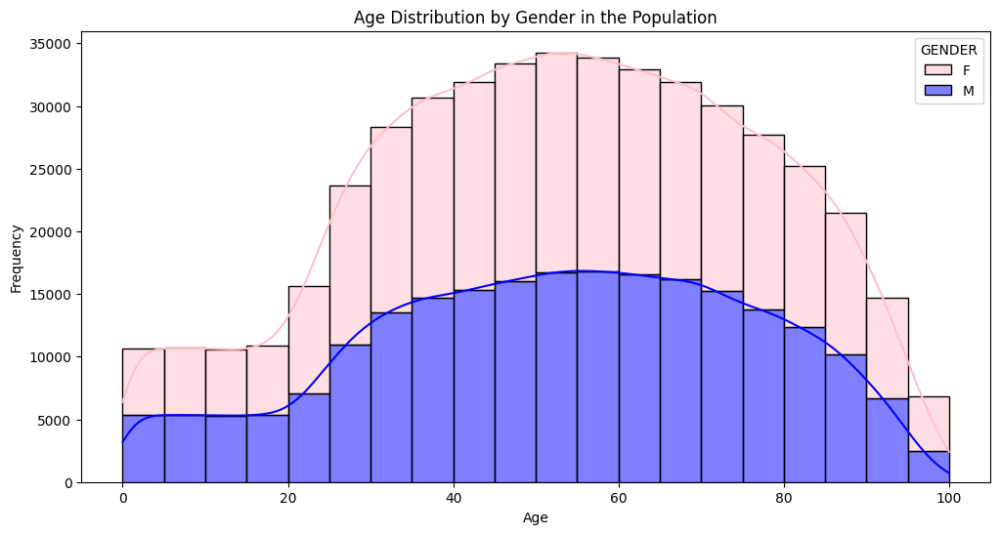
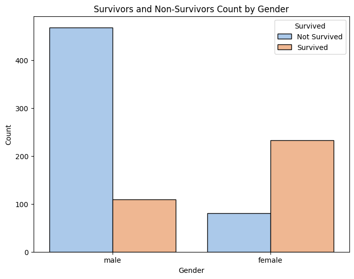
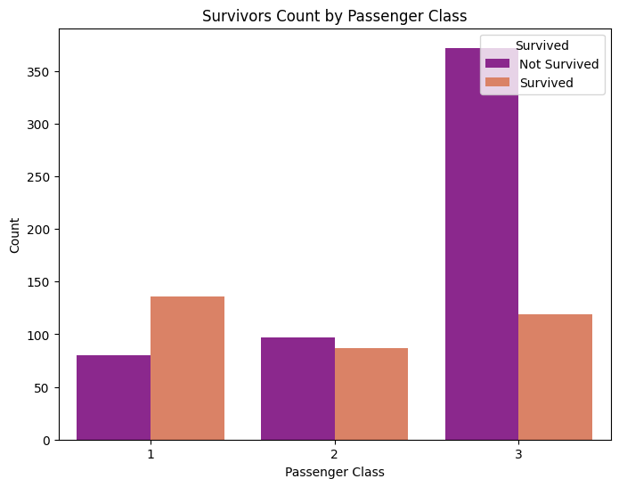
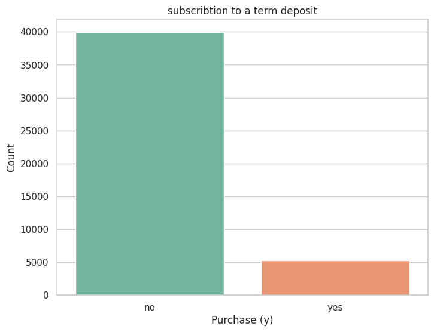
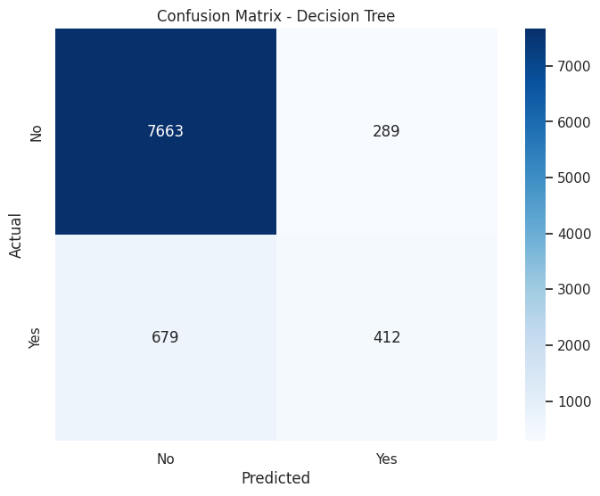
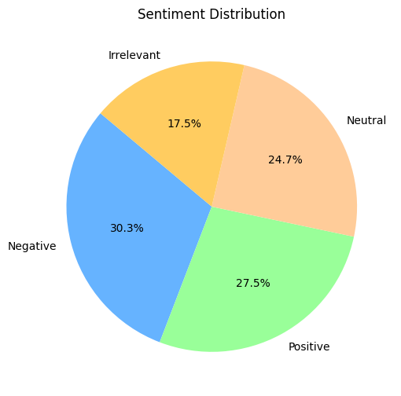
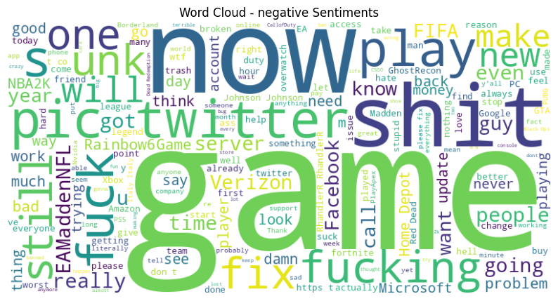

# 📊 Prodigy InfoTech — Data Science Internship Tasks

**Four progressively harder tasks: population visualisation, Titanic EDA, a decision-tree classifier on 45,211 bank marketing records, and sentiment analysis of 71,656 tweets — including one result where "improving" the model made it measurably worse at its actual job.**

---

## Overview

Four assigned tasks completed during a Data Science internship at **Prodigy InfoTech**, moving from basic visualisation through exploratory analysis to supervised learning and text analytics.

| Task | Focus | Dataset | Scale |
|---|---|---|---|
| 1 | Distribution visualisation | Belgian population statistics | 465,418 records |
| 2 | Data cleaning & EDA | Titanic (Kaggle) | 1,309 passengers |
| 3 | Decision tree classifier | Bank Marketing (UCI) | 45,211 clients |
| 4 | Sentiment analysis | Twitter/social media | 71,656 tweets |

---

## Task 1 — Distribution Visualisation

**Dataset:** Belgian population data — 465,418 rows across 13 columns (municipality, district, province, region, age, gender, nationality, civil status).



*Population age distribution split by gender, with kernel density overlay. The shape of a national population differs fundamentally from the Olympic athlete distribution in my other repository — here the full lifespan is represented, not a narrow performance window.*

Visualisations produced: age histogram, gender counts, civil status distribution, nationality breakdown, provincial distribution, and a marital status pie chart.

---

## Task 2 — Titanic: Data Cleaning & Exploratory Analysis

**Dataset:** Kaggle Titanic — train (891) and test (418) sets merged into 1,309 passenger records.

**Cleaning approach — the part worth noting:**

```python
median_age_per_group = df.groupby(['Pclass', 'Sex'])['Age'].median()
```

Missing ages (263 of them) were imputed with the **median age within each passenger-class and sex group**, not the overall median. A first-class woman and a third-class man had genuinely different age profiles, and group-wise imputation preserves that structure instead of flattening it.




*Survival counts broken down by sex and by passenger class. Both variables separate survivors sharply — the "women and children first" protocol and the physical position of third-class cabins below deck are both visible directly in the data.*

Also explored: fare outliers via boxplot, age distribution among survivors via violin plot, and an engineered `FamilySize` feature (`SibSp + Parch`) cross-tabulated against survival.

---

## Task 3 — Bank Marketing: Decision Tree Classifier

**Dataset:** UCI Bank Marketing — 45,211 clients, 17 features. **Target:** will the client subscribe to a term deposit?



*Distribution of the target variable. The overwhelming majority of clients did **not** subscribe — and this imbalance is the single most important fact about the whole task.*

### Results — and the lesson hiding inside them

| | Baseline tree | Tuned tree (GridSearchCV) |
|---|---|---|
| Accuracy | 0.87 | **0.8928** ⬆️ |
| Precision | 0.48 | 0.5869 ⬆️ |
| **Recall** | **0.48** | **0.3776** ⬇️ |
| F1 Score | 0.48 | 0.4596 ⬇️ |

Best hyperparameters: `max_depth=7, min_samples_leaf=2, min_samples_split=5`

**Read that table carefully. Accuracy went up, and the model got worse.**

The business goal is to *identify clients who will subscribe* so the marketing team can call them. Recall measures exactly that — of all the clients who would have said yes, how many did we find? Tuning pushed recall from 0.48 down to **0.38**, meaning the "improved" model **misses nearly two-thirds of the customers it exists to find**.

What happened is straightforward: because roughly 88% of clients say no, a model can score 88% accuracy by predicting "no" every single time. GridSearchCV was optimising for accuracy, so it drifted toward exactly that degenerate behaviour — becoming more conservative, predicting "yes" less often, looking better on the metric while becoming less useful.



*Confusion matrix for the tuned classifier. The false-negative cell — clients who would have subscribed but were predicted as "no" — is where the business cost actually lives.*

**What should have been done instead:** optimise for F1 or recall rather than accuracy, apply `class_weight='balanced'`, resample the minority class (SMOTE), or move the decision threshold. I'm documenting this rather than quietly reporting the 89% accuracy, because **choosing the wrong metric is one of the most common and most expensive mistakes in applied machine learning**, and this is a clean example of it.

---

## Task 4 — Social Media Sentiment Analysis

**Dataset:** 73,996 tweets → **71,656 after deduplication**, labelled by entity (brand/game) and sentiment.



| Sentiment | Count |
|---|---|
| Negative | 21,698 |
| Positive | 19,713 |
| Neutral | 17,708 |
| Irrelevant | 12,537 |

**Negative sentiment slightly outweighs positive** — consistent with the well-documented pattern that people are more motivated to post about brands when unhappy than when satisfied.

Entities are gaming and tech brands (Call of Duty, League of Legends, Microsoft, Amazon, Verizon, Facebook), each with roughly 2,200–2,300 tweets — a deliberately balanced sample by entity.



*Word cloud generated from tweets labelled negative. Word clouds are eye-catching but analytically weak — they show raw frequency without context, and common words dominate regardless of importance.*

Also produced: sentiment breakdown per entity, allowing brand-level comparison of public reception.

---

## Limitations

- **Task 3's tuned model should not be used as-is.** It is documented here as an instructive failure, not a deployable result.
- **Task 4 used pre-labelled sentiment** rather than building a classifier — this is descriptive analysis, not sentiment *prediction*.
- Word clouds convey little beyond word frequency; TF-IDF or topic modelling would extract far more.
- No train/test methodology in Tasks 1, 2 and 4 — they are exploratory by design.

## Tech Stack

`Python` · `pandas` · `numpy` · `matplotlib` · `seaborn` · `scikit-learn` (DecisionTreeClassifier, GridSearchCV, LabelEncoder) · `wordcloud`

## Repository Contents

```
├── task_1_Distribution_Visualization.ipynb   # Population data visualisation
├── task_2_Exploratory_Data_Analysis.ipynb    # Titanic cleaning and EDA
├── task_3_ML_decision_tree.ipynb             # Bank marketing classifier
├── task_4_tweets_study.ipynb                 # Sentiment analysis
└── assets/                                    # Result figures
```

## Context

Completed during a Data Science internship at **Prodigy InfoTech**. Task briefs were provided by the company; all analysis and code are my own.

## Author

**Aya Belaidi** — [GitHub](https://github.com/youcine)
